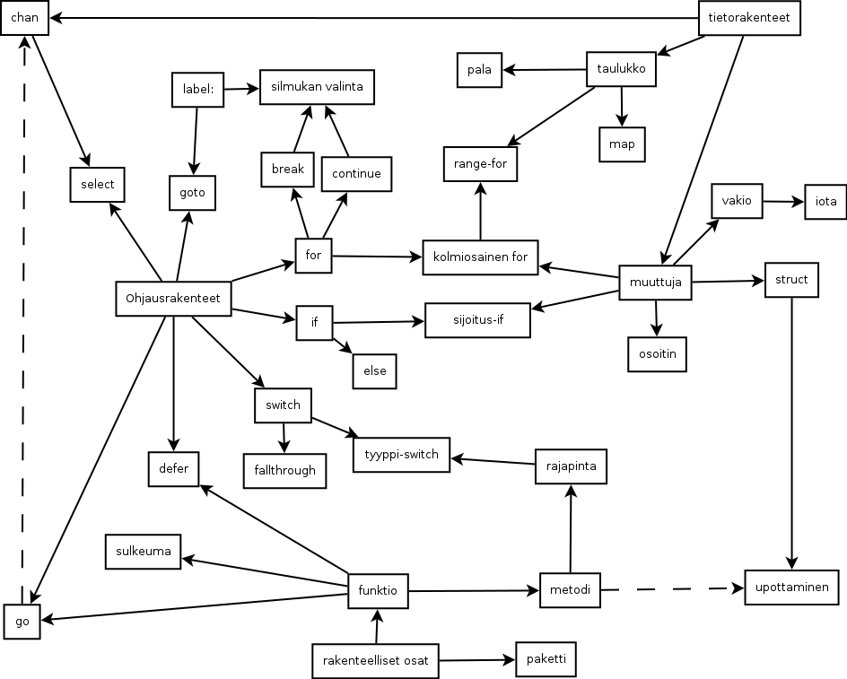

# go-opas
Suomenkielinen opas Go-kieleen aloittelijoille. Epälineaarinen, muistuttaa teknologiapuuta. Pyrkii kattamaan kaikki kielen ominaisuudet.

Opas pyrkii olemaan kertomatta epäolennaisia yksityiskohtia heti, kuitenkaan opettamatta mitään väärin yksinkertaisuuden vuoksi.

[Aloita ohjelmoinnin opiskelu!](ohjeet/alku.md)

## Jos olet jo aloittanut, valitse tästä seuraava tehtävä

[Hello, world!](tehtävät/helloworld.md)

[Viivojen piirtäminen](tehtävät/viivat.md)

[Salasanan kysyminen](tehtävät/salasana.md)

[Valintapeli](tehtävät/valintapeli.md)

### Go

Nuoli on vaatimus. Esim. `else`ä ei voi opetella ennen `if`iä. Asiaa, josta lähtee katkoviiva ei tarvitse osata, mutta uudella asialla ei välttämättä tee mitään ilman sitä.
