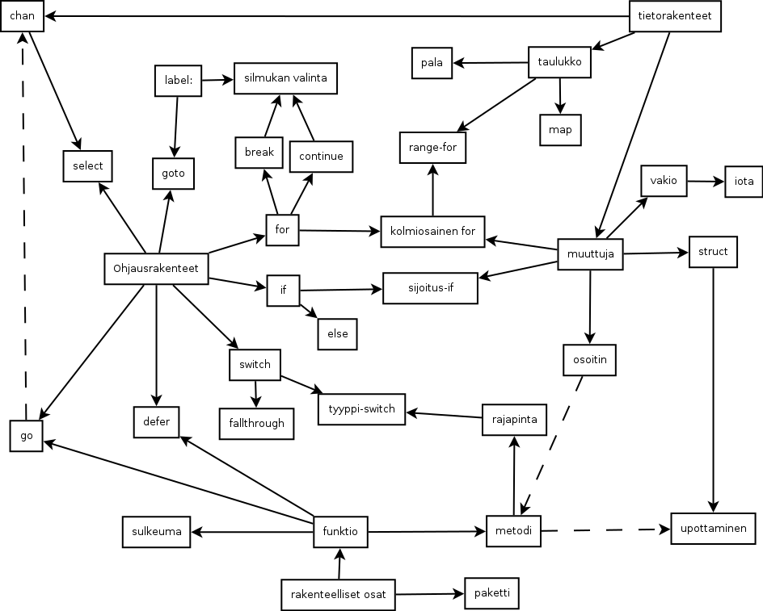

# go-opas
Suomenkielinen opas Go-kieleen aloittelijoille. Epälineaarinen, muistuttaa teknologiapuuta. Pyrkii kattamaan kaikki kielen ominaisuudet.

Opas pyrkii olemaan kertomatta epäolennaisia yksityiskohtia heti, kuitenkaan opettamatta mitään väärin yksinkertaisuuden vuoksi.

##[Aloita ohjelmoinnin opiskelu!](ohjeet/alku.md)

## Jos olet jo aloittanut, valitse tästä seuraava aihe

### Go

Nuoli on vaatimus. Esim. elseä ei voi opetella ennen iffiä. Asiaa, josta lähtee katkoviiva ei tarvitse osata, mutta uudella asialla ei välttämättä tee mitään ilman sitä.