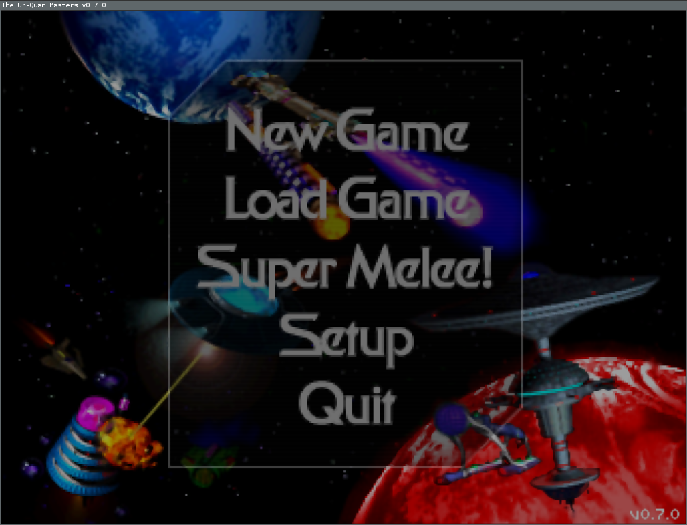

# Mikä on ohjelma?

_Tämä ei ole ohjelma!_

Ohjelmaa ei voi nähdä, kuulla, haistaa, maistaa eikä tuntea. Se ei ole lämmin eikä kylmä.

Ikkuna ei ole ohjelma, samalla tavalla kuin näyttö ei ole tietokone.

Ohjelma on tiedosto täynnä käskyjä, joita tietokone osaa noudattaa.