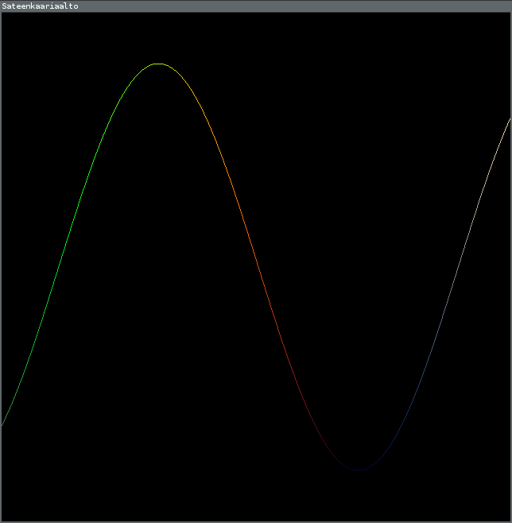

# Lisää viivoja

Tämän ohjelmän nimi on `aalto`. En liittänyt kuvaa tästä ohjelmasta, sillä se näyttää eri aikoihin erilaiselta.

Muistatko kun sanoin:

> Runin ottaman funktion on pakko ottaa yksi `float64`-tyyppinen argumentti, eikä se saa palauttaa mitään.

Tämä argumentti kertoo ajan ohjelman käynnistymisestä sekunteina. Käyttämällä tätä aikaa pisteiden paikkojen laskemiseen, saadaan asiat liikkumaan.

Käytän koodissa siniä(`math.Sin`) aallon pisteiden korkeuden laskemiseen. Sini muuttaa luvun luvuksi välillä [-1, 1] yksitoikkoisen aaltoilevasti. Sinun ei ole pakko käyttää siniä omassa koodissasi.

`gl.LINE_STRIP` tarkoittaa että piirretään viivoja pötkönä, eli edellisen viivan loppu on seuraavan alku. Lisäksi tästä koodista löytyy lähinnä [`for`](../ohjeet/for.md) ja [_muuttuja_](../ohjeet/var.md). `const pisteitä = 200` aiheuttaa sen että sana pisteet korvataan numerolla 200.

Funktio `nollastaYhteen` ottaa luvun ja palauttaa luvun nollan ja yhden väliltä sinin lailla aaltoilevasti. Tein sen, koska värin suurin mahdollinen kirkkaus on 1.0 ja pienin 0.0.

### Tehtäviä

 - Tee aallosta tiheampi, harvempi, nopeampi tai hitaampi.
 - Tee jokin kuvio, esim. neliö, joka liikkuu kohti ikkunan oikeaa reunaa.
 - Tee monta aaltoa.
 - Tee kuvio, joka venyy.
 - Tee pyörivä kuutio (Tee tämä, jos sait edellisessä kohdassa tehtyä ympyrän.)
 - Tee aallon eri kohdista eri värisiä. 

Vinkki toiseen tehtävään:

>Aloita neliöstä, jonka teit edellisissä tehtävissä. Lisää neliön jokaisen pisteen ensimmäiseen koordinaattiin aika kerrottuna nopeudella, jolla haluat pisteen liikkuvan.