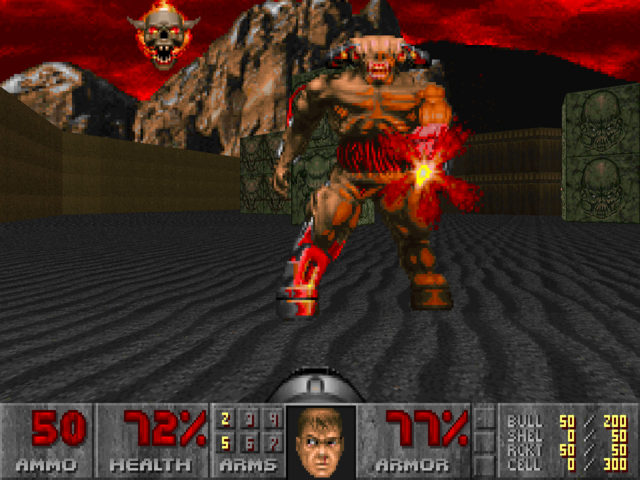

# BOSS: Cyberdemon

Doomin kyberdemoniin kuulee usein sanottavan "Shoot it till it dies.". Tämä viittaa siihen, että demonin yhdestä osumasta tappavia raketinheittimiä on helppo väistää kulman taakse, mutta siihen saa osua lukemattomia kertoja ennen kuin se kuolee. Demoni ei tietenkään millään tavalla osoita ottaneensa vauriota ennen kuin se kaatuu.

Meidän kyberdemoni kestää 1024 osumaa.

Kyberdemonilla on kaikkien bossien tarjoaman Kuollut-metodin lisäksi metodi Ammu.

Tehtävänäsi on kirjoittaa funktio TapaDemoni, joka ottaa kybedemonin osoitteen ja tappaa sen.