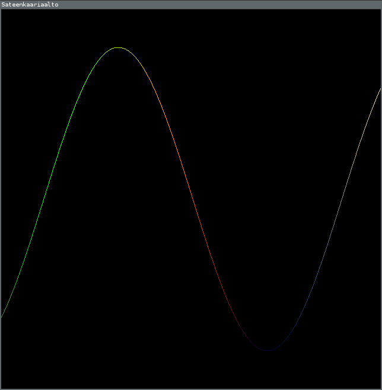

# Viivojen piirtäminen

Tähän tehtävään liittyy kaksi esimerkkiohjelmaa. Saat ladattua ne komennolla `go get github.com/joonazan/go-opas/esimerkit/...` Pääset heti kokeilemaan niitä kirjoittamalla komentoriviin ohjelman nimen. Ensimmäisen nimi on `viivat` ja toisen `aalto`.

## `viivat`


Kansiosta `go/src/github.com/joonazan/go-opas/esimerkit/viivat` löytyy tiedosto `main.go`. Se sisältää koodin, joka piirtää kaksi viivaa.

```Go
closedgl.Run(piirrä, 640, 640, "Kaksi viivaa")
```

Paketin `closedgl` [_funktio_](../ohjeet/funktio.md) `Run` avaa ikkunan ja kutsuu sitten toistuvasti sille annettua funktiota(tässä tapauksessa `piirrä`) kunnes ikkuna suljetaan. Loput Runin argumentit kertovat ikkunan koon ja nimen.

Runin ottaman funktion on pakko ottaa yksi `float64`-tyyppinen argumentti, eikä se saa palauttaa mitään.

```Go
gl.Begin(gl.LINES)
```

Tämä funktio aloittaa piirtämisen. `gl.LINES` kertoo, että piirretään viivoja. `gl.End()` taas lopettaa piirtämisen.

```Go
gl.Color3d(1, 0, 0)
gl.Vertex2d(0, 0)
gl.Vertex2d(0, 0.5)
```

`gl.Vertex2d` piirtää kaksiulotteisen pisteen. On olemassa myös `gl.Vertex3d`, joka piirtää kolmiulotteisen pisteen. Yllättävää kyllä, viivassa on kaksi pistettä, joten Vertexiä pitää kutsua kahdesti yhtä viivaa varten.

Numerot kertovat pisteen sijainnin. `0, 0` on keskellä ikkunaa. Ensimmäinen koordinaatti kasvaa oikealle mentäessä ja toinen ylös mentäessä. Ikkunan reunassa koordinaattit ovat `1` tai `-1`.

`gl.Color3d` valitsee värin jolla ollaan piirtämässä. Väri on siinä mielessä kolmiulotteinen, että siinä on kolme osaa: punainen, vihreä ja sininen. Tämähän kuulostaa aivan hullulta! Se johtuu siitä, että `3d` ei oikeasti tarkoita kolmiulotteista, vaan 3 double. [Tyyppiä](../ohjeet/tyypit.md) `float64` joskus kutsutaan nimellä double.

### Tehtäviä
Voit tehdä kaikki, tai vain kiinnostavimmalta kuulostavat.

 - Piirrä kaksi viivaa lisää niin, että muodostuu neliö.
 - Piirrä kolmio.
 - Piirrä risti.
 - Piirrä ympyrä. (Tämä on vaikea vaikka osaisit for-silmukan!)
 - Piirrä tikku-ukko.

Kun olet tehnyt muutoksia ohjelmaan, käännä se komennolla `go install github.com/joonazan/go-opas/esimerkit/viivat` ja aja se komennolla `viivat`. Tietenkin jos olet esimerkiksi ottanut kopion koodista kansioon `go/src/viivoja`, komento olisi `go install viivoja`. Pitkiä komentoja ei tarvitse kirjoittaa joka kerta uudestaan: ne saa takaisin painamalla nuolinäppäintä ylös komentorivissä.

## `aalto`

En liittänyt kuvaa tästä ohjelmasta, sillä se näyttää eri aikoihin erilaiselta.

Muistatko kun sanoin:
> Runin ottaman funktion on pakko ottaa yksi `float64`-tyyppinen argumentti, eikä se saa palauttaa mitään.

Tämä argumentti kertoo ajan ohjelman käynnistymisestä sekunteina. Käyttämällä tätä aikaa pisteiden paikkojen laskemiseen, saadaan asiat liikkumaan.

Käytän koodissa siniä(`math.Sin`) aallon pisteiden korkeuden laskemiseen. Sini muuttaa luvun luvuksi välillä [-1, 1] yksitoikkoisen aaltoilevasti. Sinun ei ole pakko käyttää siniä omassa koodissasi.

`gl.LINE_STRIP` tarkoittaa että piirretään viivoja pötkönä, eli edellisen viivan loppu on seuraavan alku. Lisäksi tästä koodista löytyy lähinnä [`for`](../ohjeet/for.md) ja [_muuttuja_](../ohjeet/var.md). `const pisteitä = 200` aiheuttaa sen että sana pisteet korvataan numerolla 200.

Funktio `nollastaYhteen` ottaa luvun ja palauttaa luvun nollan ja yhden väliltä sinin lailla aaltoilevasti. Tein sen, koska värin suurin mahdollinen kirkkaus on 1.0 ja pienin 0.0.

### Tehtäviä

 - Tee aallosta tiheampi, harvempi, nopeampi tai hitaampi.
 - Tee jokin kuvio, esim. neliö, joka liikkuu kohti ikkunan oikeaa reunaa.
 - Tee monta aaltoa.
 - Tee kuvio, joka venyy.
 - Tee pyörivä kuutio (Tee tämä, jos sait edellisessä kohdassa tehtyä ympyrän.)
 - Tee aallon eri kohdista eri värisiä. 

Vinkki toiseen tehtävään:
>Aloita neliöstä, jonka teit edellisissä tehtävissä. Lisää neliön jokaisen pisteen ensimmäiseen koordinaattiin aika kerrottuna nopeudella, jolla haluat pisteen liikkuvan.
