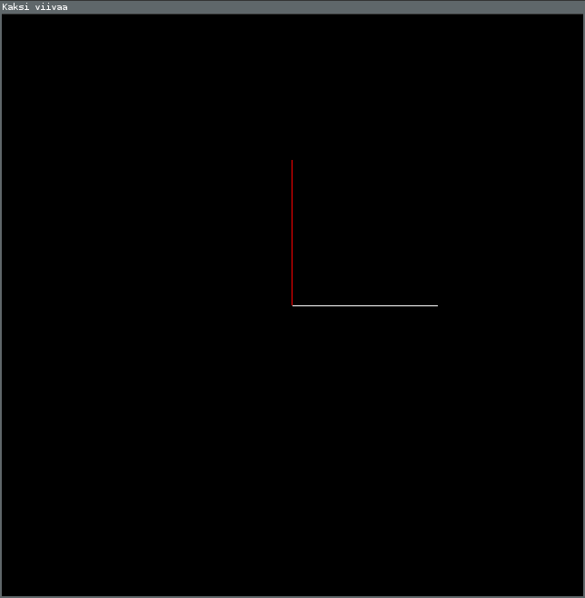

# Viivojen piirtäminen

Tähän tehtävään liittyy kaksi esimerkkiohjelmaa. Saat ladattua ne komennolla `go get github.com/joonazan/go-opas/esimerkit/...` Pääset heti kokeilemaan niitä kirjoittamalla komentoriviin ohjelman nimen. Ensimmäisen nimi on `viivat` ja toisen `aalto`.

## `viivat`



Kansiosta `go/src/github.com/joonazan/go-opas/esimerkit/viivat` löytyy tiedosto `main.go`. Se sisältää koodin, joka piirtää kaksi viivaa.

```Go
closedgl.Run(piirrä, 640, 640, "Kaksi viivaa")
```

Paketin `closedgl` funktio `Run` avaa ikkunan ja kutsuu sitten toistuvasti sille annettua funktiota(tässä tapauksessa `piirrä`) kunnes ikkuna suljetaan. Loput sen argumentit kertovat ikkunan koon ja nimen.

```Go
gl.Begin(gl.LINES)
```

Tämä funktio aloittaa piirtämisen. `gl.LINES` kertoo, että piirretään viivoja. `gl.End()` taas lopettaa piirtämisen.

```Go
gl.Color3d(1, 0, 0)
gl.Vertex2d(0, 0)
gl.Vertex2d(0, 0.5)
```

`gl.Vertex2d` piirtää kaksiulotteisen pisteen. On olemassa myös `gl.Vertex3d`, joka piirtää kolmiulotteisen pisteen. Yllättävää kyllä, viivassa on kaksi pistettä, joten `Vertex`:ä pitää kutsua kahdesti yhtä viivaa varten.

Numerot kertovat pisteen sijainnin. `0, 0` on keskellä ikkunaa. Ensimmäinen koordinaatti kasvaa oikealle mentäessä ja toinen ylös mentäessä. Ikkunan reunassa koordinaattit ovat `1` tai `-1`.

`gl.Color3d` valitsee värin jolla ollaan piirtämässä. Väri on siinä mielessä kolmiulotteinen, että siinä on kolme osaa: punainen, vihreä ja sininen. Tämähän kuulostaa aivan hullulta! Se johtuu siitä, että `3d` ei oikeasti tarkoita kolmiulotteista, vaan 3 double. [Tyyppiä](../ohjeet/tyypit.md) `float64` joskus kutsutaan nimellä double.

### Tehtäviä
Voit tehdä kaikki, tai vain kiinnostavimmalta kuulostavat.

 - Piirrä kaksi viivaa lisää niin, että muodostuu neliö.
 - Piirrä kolmio.
 - Piirrä risti.
 - Piirrä ympyrä.
 - Piirrä tikku-ukko.
